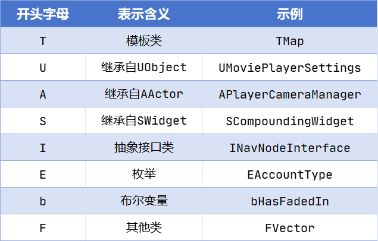
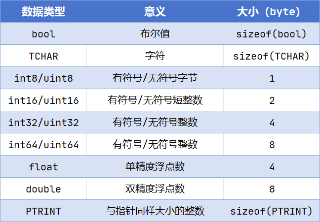

### 通用代码规范
##### 何为代码规范？
- 一系列该语言编写的指导方针
- 覆盖缩进、注释、命名、空格使用、换行等方面
- 由团队/组织/公司制定
##### 为什么要做代码规范
- 代码需要自己或别人长期维护
- 一致的风格降低团队其他成员的阅读成本
- 降低复杂度
	- 搜索便利
	- 注释
- 对自己而言，一以贯之的风格有助于高效书写
	- 减少内耗
	- 内心认同，书写愉悦
##### 规范
- 命名
```C++
//符合规范的命名
int price_count_reader;    // 无缩写
int num_errors;            // "num"是一个常见的写法
int num_dns_connections;   // 人人都知道"DNS"是什么
//不符合规范的命名
int n;                     // 毫无意义
int nerr;                  // 含糊不清的缩写
int n_comp_conns;          // 含糊不清的缩写
int wgc_connections;       // 只有负责团队知道是什么意思
int pc_reader;             // "pc"有太多可能的解释
int cstmr_id;              // 删减了若干字母
```
- 格式
	- 缩进4空格
	- 用空行将代码片段分开
- 书写
	- 直白易懂
	- 关键逻辑添加注释
### UE5的C++代码规范
##### 命名
- 清晰、明确、避免过度缩写
- 大驼峰式命名
- 前缀规范：
- 引用传入可能修改的函数变量，加`out`前缀
##### 数据类型
1. 基础类型：
	- 在定义类的成员变量时，对于`uint8`也有`uint8 num:1`的写法，后面的`:1`代表虽然这是个`uint8`类型，但这个变量只占用`1 bit`的空间，比完整的使用`uint8`或使用`bool`而言占用的空间缩小为原来的$\frac18$，多用于处理开关逻辑，有空间上的优势
2. 字符串类、容器类：使用UE定义的字符串类`FString/FText/FName/TCHAR`；应避免使用stl，使用UE提供的容器类`TArray\TMamp`等
##### 代码风格
- 大括号换行
- `if-else`对齐
- 使用Tab缩进
- `switch-case`语句`fall-through`时添加注释
##### 命名空间
- `UnrealHeaderTool`仅支持全局命名空间的类型
- 不要在全局命名空间使用`using`声明
- 一些宏在命名空间内可能会失效，可以尝试`UE_`前缀的版本
##### C++11
- 不要使用`NULL`宏，使用`nullptr`来表示空指针
- Lambda函数须明确指出返回类型
- 不要使用`auto`，除了：Lambda函数、迭代器声明、模板中类型推导
##### etc：[官方文档](https://dev.epicgames.com/documentation/zh-cn/unreal-engine/epic-cplusplus-coding-standard-for-unreal-engine)
##### 如何写符合规范的代码
- 熟悉代码规范，理解规范设立的原因
- 使用辅助工具，标注出不符合规范的代码（Cpplint, Resharper C++等）
### UE5中的标识符
##### 参考文档
- [github](https://github.com/fjz13/UnrealSpecifiers)
- [bilibili](https://www.bilibili.com/video/BV1152LYrECW/)
- [官方文档](https://dev.epicgames.com/documentation/zh-cn/unreal-engine/metadata-specifiers-in-unreal-engine)
##### 示例
```C++
UCLASS(Blueprintable, EditAnywhere, meta=(ShortTooltip="这是一个示例类")) 
class MYPROJECT_API UMyExampleClass : public UObject 
{ 
	GENERATED_BODY() 
public: 
	// 属性声明，包含Meta标签 
	UPROPERTY(EditAnywhere, meta=(UIMin="0", UIMax="100")) 
	int32 MyIntProperty; 
	
	// 函数声明，包含BlueprintCallable标识符 
	UFUNCTION(BlueprintCallable) 
	void MyBlueprintFunction(); 
};
```
- `UCLASS`宏包含了`Blueprintable`和`EditAnywhere`标识符，使得该类可以在蓝图中被实例化和编辑。
- `meta=(ShortTooltip="这是一个示例类")`提供了一个简短的提示信息。
- `MYPROJECT_API`表示该类将从这个模块导出，以支持跨模块的访问
- `UPROPERTY`宏中的`EditAnywhere`标识符允许在编辑器中编辑`MyIntProperty`属性，同时`meta=(UIMin="0", UIMax="100")`限制了该属性的最小值和最大值。
- `UFUNCTION(BlueprintCallable)`使得`MyBlueprintFunction`函数可以在蓝图中被调用。
##### `UPROPERTY`
1. 标识符
	- `Visible Anywhere`值在编辑器中可见
	- `Edit Anywhere`值在编辑器中可修改
	- `Category`在编辑器中添加下拉菜单，把相关的变量集中起来
	- `Advanced Display`将变量在编辑器中默认收起不展示
	- `BlueprintReadOnly`
	- `BlueprintReadWrite`
1. meta标签
	- `Display Name`变量在编辑器中显示的名字
	- `Display Priority`调整变量在编辑器中显示的位置
	- `Clamp Min/Max`限制了变量的最小值和最大值
##### `UFNCTION`
- 标识符：`BlueprintCallable`该函数在蓝图中可查找
- 可在meta标签中为函数设置默认值
##### `UCLASS`
1. 标识符：`ShortTooltip`为类写一个注释
2. 注意：
	- 添加`GENERATED_BODY()`，这是UE反射系统的一部分，用于可视化类的信息
	- 添加构造函数`MyClass(const FObjectInitializer& ObjectInitializer);`
##### `USTRUCT`
##### `UENUM`
- 在`enum`声明时应`enum class MyEnum{};`，使用`class`能避免枚举重名的情况