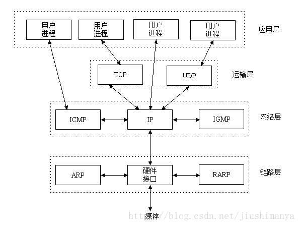
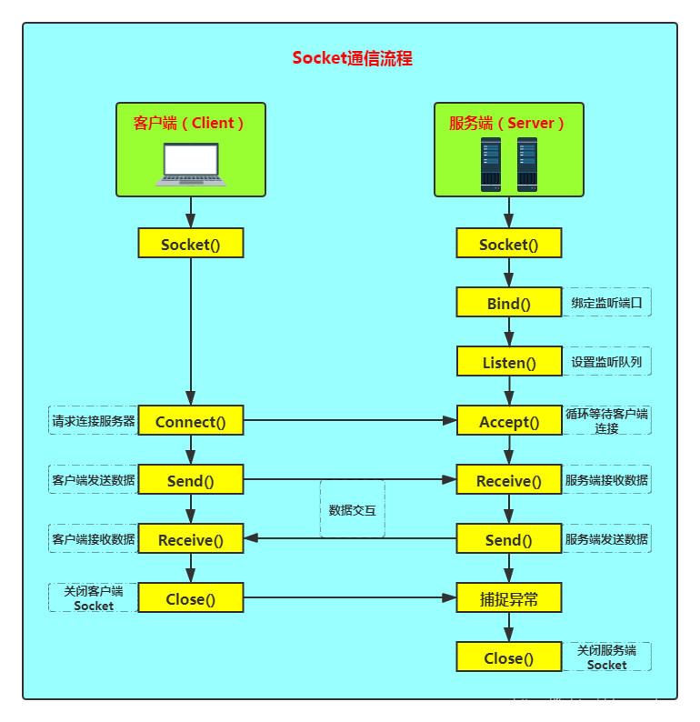
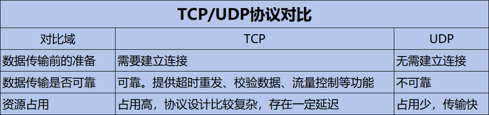
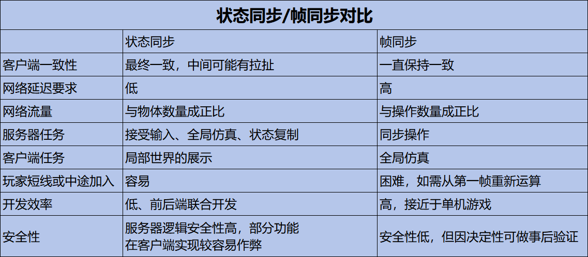
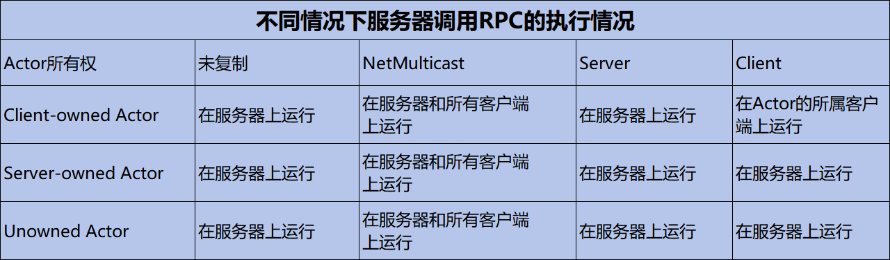
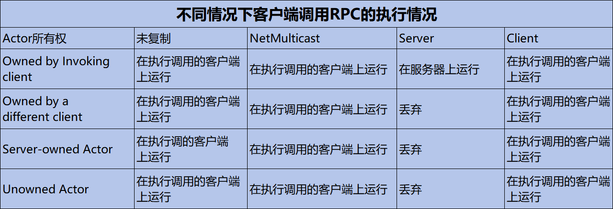

[Unreal官方多人游戏编程快速入门指南（使用C++）](https://dev.epicgames.com/documentation/zh-cn/unreal-engine/multiplayer-programming-quick-start-for-unreal-engine)
### 计算机网络基础
##### 计算机网络体系结构（分层结构），分层结构的优势：
- 功能独立、维护便利
- 简化设计
- 层内部的设计标准化
- 灵活、可扩展
- 故障隔离，便于定位问题所在
#####  [Socket](https://blog.csdn.net/jiushimanya/article/details/82684525)：
- 概念：Socket是应用层和传输层之间的一个抽象层，它把TCP/IP层复杂的操作抽象为几个简单的接口供应用层调用以实现进程在网络中通信；
- 通信流程：Socket是”打开——读/写——关闭“模式的实现，UDP模式服务端没有Listen、Accept，客户端没有Connect流程；
##### [TCP](https://blog.csdn.net/qq_43145072/article/details/105565062)/[UDP](https://zhuanlan.zhihu.com/p/357080855)

##### P2P、C/S架构
1. [P2P（Peer to Peer）](https://blog.csdn.net/JAZJD/article/details/139077779)：也称点对点，是无中心服务器、依靠用户群交换信息的互联网体系。网络中的每个用户端既是一个节点，也具有服务器功能
2. [C/S（Client/Server）](https://blog.csdn.net/weixin_74612079/article/details/131234133)架构：也称主从式架构，架构分为服务端和客户端，所有客户端只和服务端对连，客户端之间的通信必须通过服务器，软件开发简单，可控性好。服务器压力较大。
### 数据同步基础
##### [RPC（Remote Process Call）](https://blog.csdn.net/daobuxinzi/article/details/133931185)
- 概念：RPC，即远程过程调用。本地调用远端提供的函数/方法，因为不是同一个内存空间，不能直接调用，需要通过网络来表达调用的语义和传达调用的数据
- 实现：
	- 需要解决的问题：在远程调用时，我们需要执行的函数体是在远程的机器上的，也就是执行是在另一个进程中。另一端是不知道函数指针和堆栈数据的
	- Call ID映射：通过Call ID识别所要调用的函数
	- 序列化与反序列化：压缩、加密调用函数时的一些参数数据，提高传输效率
	- 网络传输：
##### 对象序列化：
- 类似于函数ID映射，本地用到的对象想要在另一端也能够直接使用，这样会大大简化上层业务逻辑开发，这就需要对象序列化。
- 对象序列化是将对象转换成一系列字节，这样对象就可以很容易地保存到持久存储中，或者通过通信链路传输。然后可以将字节流反序列化——转换为原始对象的副本
- 属性同步：属性同步是对象序列化后产生的性质，属性同步一般是服务器更改，同步到其他所有客户端，主要是为了解决数据冲突和安全性考虑
##### [帧同步与状态同步](https://blog.csdn.net/qq_41211553/article/details/106983481)
- 帧同步：帧同步技术是早期RTS游戏常用的一种同步技术。与状态同步不同的是，帧同步**只同步操作**，其大部分游戏逻辑都在客户端上实现，服务器主要负责广播和验证操作，**有着逻辑直观易实现、数据量少、可重播，一致性好等优点**。
- 状态同步：
	- **同步的是游戏中的各种状态**。一般的流程是客户端上传操作到服务器，服务器收到后计算游戏行为的结果，然后以广播的方式下发游戏中各种状态，客户端收到状态后再根据状态显示内容。
	- 状态同步其实是一种不严谨的同步。它的思想中，不同玩家屏幕上的表现的一致性并不是重要指标，只要每次操作的结果相同即可。所以状态同步**对网络延迟的要求并不高，甚至充许一段时间的不一致**。
- 
- 网络延迟高或者抖动，会影响游戏体验，常见的表现有**拉扯**、**瞬移**、**攻击敌方没有伤害**等，对抗延迟的方法有：
	- 服务器延迟补偿
	- 客户端平滑算法：
		- 插值
		- 预测
		- 缓存
### UE网络同步的使用
##### UE网络同步模型
1. 以“客户端-服务器”模型为基础
2. 实现面向对象式封装
3. 实现网络代码和游戏逻辑完全分离
4. 网络同步支持可视化编程
5. 网络协议使用UDP通讯
##### UE网络模型
1. Standalone：此类型说明服务器在本地计算机上运行且不接受来自远程计算机的客户端，适合单人游戏或本地多人游戏
2. DedicatedServer：专用服务器，不承担玩家的功能。可以通过丢弃声音、图形、用户输入和其他面向玩家的功能来更高效地运行。此类型服务器用于托管在受信任服务器上的多人游戏
3. ListenServer：监听服务器是一个既承担本地玩家功能，同时也对来自远程玩家的连接开放的服务器。此类型服务器适用于不需要专属服务器，且用户可以在没有第三方服务器的情况下设置和游玩竞争或合作类游戏。
5. Client：这是唯一的非服务器模式。在此模式下，本地计算机是专属或监听服务器的客户端，因此不会运行服务器端逻辑
##### 客户端与服务端连接流程
1. Client：`UPendingNetGame::SendInvitation 发送加入请求`
2. Server：`UWorld::NotifyControlMessage 检验客户端版本是否一致`
3. Client：`UPendingNetGame::NotifyControlMessage 发送登录请求`
4. Server：`UWorld::NotifyControlMessage->AGameModeBase::PreLogin 校验逻辑`
5. Server：`UWorld::WelcomePlayer->AGameModeBase::GameWelcomePlayer 同意登录请求`
6. Client：`LoadMap`
7. Server：`AGameModeBase::Login 创建PlayerController`
8. Server：`AGameModeBase::PostLogin 登录成功，进入游戏逻辑`
##### Actor的复制，提供的同步能力：
- Creation and Destruction 创建和销毁
- Movement 移动
- ==Properities 属性==
- Components 组件
- Subobjects 子对象
- ==Remote Procedures Calls（RPC）远程程序调用==
```C++
ADemoCharacter::ADemoCharacter()
{
  bReplicates = true;  //将bReplicates设为true以启用Actor的复制功能
  CharacterMovement->SetIsReplicated(true);  
  //使用函数SetIsReplicated(true)以启用组件的复制功能
}
```
##### Role、属性同步、RPC等基础概念
1. Role权限（C/S架构）
	- `Role_None`
	- `Role_SimulatedProxy`：模拟权限，客户端所持有的权限
	- `Role_AutonomousProxy`：主控权限，服务端的玩家所持有的权限
	- `Role_Authority`：权威，服务端所具有的权限
2. 属性同步
```C++
//头文件中的定义
UPROPERTY(Replicated)  //添加Replicated参数以启用同步功能
float Health;
UPROPERTY(Replicated)
int Exp;
UPROPERTY(ReplicatedUsing = OnRep_Level)  //添加回调函数功能
int Level

UFUNCTION()
void OnRep_Level(int OldLevel);

//cpp文件中的实现
void ADemoCharacter::OnRep_Level(int OldLevel)
{
  //回调函数逻辑
}

void ADemoCharacter::GetLifetimeReplicatedProps(TArray<FLifetimeProperty>& OutLifetimeProps) const
{
	Super::GetLifetimeReplicatedProps(OutLifetimeProps);

	//所有需要复制的变量需要在这个函数中一一列举出来，并设置变量是否具有特殊的复制时机
	DOREPLIFETIME(ADemoCharacter, Health);
	DOREPLIFETIME_CONDITION(ADemoCharacter, Exp, COND_OwnerOnly);
	DOREPLIFETIME_CONDITION(ADemoCharacter, Health, COND_None);
}	
```
属性复制的规则：
1. 只支持从服务器复制到客户端，且都是Reliable的
2. 在每帧更新完所有Actor的属性状态会执行一遍所有Actor的属性复制
3. 只复制那些与上一顿对比发生过变化的属性（Lazy Replication）
4. 如果是第一次复制，则复制跟默认值对比不一致的属性
5. 只支持复制静态数组，并且只复制数组中与上一对比发生过变化的那一项
6. 支持复制结构体，结构体中任意属性与上一顿对比发生过变化，都会导致复制结构体的所有属性
7. 属性复制支持回调事件

Condition Property Replication（`DOREPLIFETIME_CONDITION`参数）

| 条件                        | 说明                                                  |
| ------------------------- | --------------------------------------------------- |
| `COND_InitialOnly`        | 该属性仅在初始数据组尝试发送                                      |
| `COND_OwnerOnly`          | 该属性仅发送至actor的所有者                                    |
| `COND_SkipOwner`          | 该属性将发送至除所有者之外的每个连接                                  |
| `COND_SimulatedOnly`      | 该属性仅发送至模拟actor                                      |
| `COND_AutonomousOnly`     | 该属性仅发送给自治actor                                      |
| `COND_SimulatedOrPhysics` | 该属性将发送至模拟或`bRepPhysicsactor`                        |
| `COND_InitialOrOwner`     | 该属性将发送初始数据包，或者发送至actor所有者                           |
| `COND_Custom`             | 该属性没有特定条件，但需要通过`SetCustomlsActiveOverride`得到开启/关闭能力 |
RPC函数
```C++
//头文件定义
UFUNCTION(Server, Reliable, WithValidation) //在服务端上运行、可靠函数、有条件的
void ServerDoSth();

UFUNCTION(Client, Unreliable)  //在客户端上运行、非可靠函数
void ClientDoSth();

UFUNCTION(NetMulticast, Unreliable)  //由服务器广播至每一个客户端执行、非可靠函数
void NetMulticastNotifySth();
//cpp文件实现
void ADemoCharacter::ServerDoSth_Implementation()
{
	//...
}
void ADemoCharacter::ServerDoSth_Validation()
{
	//...
}
void ADemoCharacter::ClientDoSth_Implementation()
{
	//...
}
void ADemoCharacter::NetMulticastNotifySth_Implementation()
{
	//...
}
// 1.支持服务器和客户端双向复制
// 2.可以被标记为：Client、Server、NetMulticast
// 3.可以是Reliable或者UnReliable的
// 4.函数复制没有返回值，也不支持输出型函数
// 5.必须在Actor上调用
```

### UE网络同步的实现
##### Unreal为何使用UDP协议
1. TCP协议的可靠性无法定制
	- 所有数据都是可靠的（游戏中很多数据是可以丢失的）
	- 为了保证数据的时序性，牺牲了时效性（一旦出现丢包，会阻塞后面数据的发送）
2. TCP协议与UDP协议混合使用？
	- 对于时序性要求很高的数据，通过TCP协议传输
	- 对于时效性要求很高的数据，通过UDP协议传输
	- 增加了设计的复杂度
	- TCP与UDP都是基于IP协议，它们在底层会互相干扰
3. 纯UDP协议的好处
	- 可自己定制丢包时的处理逻辑
	- 可以同时兼顾时序性数据和时效性数据
##### UE网络同步主要的类
- `NetDriver`——网络管理类
	- 管理网络连接，驱动整个网络收发逻辑
	- 创建和管理`NetConnection`
	- 收发网络`Packet`
	- 除了`GameNetDriver`，还有`DemoNetDriver`专门处理录像回放的逻辑
- `NetConnection`——抽象的网络连接
- `Packet`——数据包
	- 客户端与服务器之间的连接
	- 服务器会有多个`NetConnection`，每一个对应一个客户端连接
	- 客户端会有一个`ServerConnection`
	- 创建和管理`Channel`
	- 每个通信包是一个`Packet`，每个`Packet`有一个唯一的Seq，Seq自增且不会重复利用
	- `Packet`网络不稳定可能出现丢包，丢包时`Connection`不会重发，但会通知`Channel`
- `Channel`——数据传输的管道
	- 每个`NetConnection`管理着自己的Channel集合
	- `Channel`以`Bunch`为单位进行数据的接收和发送
	- 发送时，`Channel`将`Bunch`数据交给`NetConnection`以`Packet`发送
	- 接收时，`NetConnetion`将`Bunch`分发给对应的`Channel`进行处理。
	- Channel有4种类型：==`ActorChannel`==、`ControlChannel`、`FileChannel`、`VoiceChannel`
- `Bunch`——管道中传输的数据串
	- 数据流通的基本单位
	- 位流，充分利用了每一个Bit
		- 对于`bool`型的数据，使用一个`Bit`来存储
		- 对于其他类型的数据，会根据数据的范围选择最节省的若干个Bit来存储
	- `Reliable`&`UnReliable`
		- `ReliableBunch`，保证一定会发送到远端，并且按发送的顺序进行处理
		- `UnReliableBunch`，网络丢包有可能导致`Bunch`不能发送到远端

##### `Channel`&`Bunch`一些问题
1. Q：`Channel`是如何打开的？
2. A：每个`Channel`所发送的第一个`Bunch`，`Bunch`头部会自动带上`Open`的标志位以及`Channel`的类型和序号，通知远端创建对应的`Channel`。
3. Q：`Channel`是如何处理`Packet`的确认信号的？
4. A：`Channel`发送`Bunch`的同时会将该`Bunch`复制一份缓存到输出链表，等远端确认收到该`Bunch`后才从缓存中清除
5. Q：`Channel`是如何处理`Packet`丢失的？
6. A：`Channel`缓存（最多128个）`ReliableBunch`，并对丢失的`Bunch`进行重发，确保`ReliableBunch`能发送到远端。
7. Q：`Channel`是如何保证按顺序处理`Bunch`的？
8. A：`ReliableBunch`是带序号的，`Channel`会缓存收到的不连续的`Bunch`，确保`Bunch`能按顺序处理
9. Q：`Channel`是如何关闭的？
10. A：当`Channel`关闭的时候，它会发送一个独立的空的`Bunch`，`Bunch`头部带上了`Close`的标志位，同时把本地的`Channel`标志为`Closing`状态，禁止接收或发送任何数据，等远端收到该`Bunch`并返回确认信号后，`Channel`才会真正地关闭。
##### 网络分析工具
1. Network Profiler
	- 查看网络相关的属性
	- 检索网络同步的属性和RPC
	- 游戏运行时动态开关
2. Network Insights
	- Unreal Insights的一部分
	- 可以实时监控
	- 可以读取utrace文件
	- 可以监控同步时的每个数据包